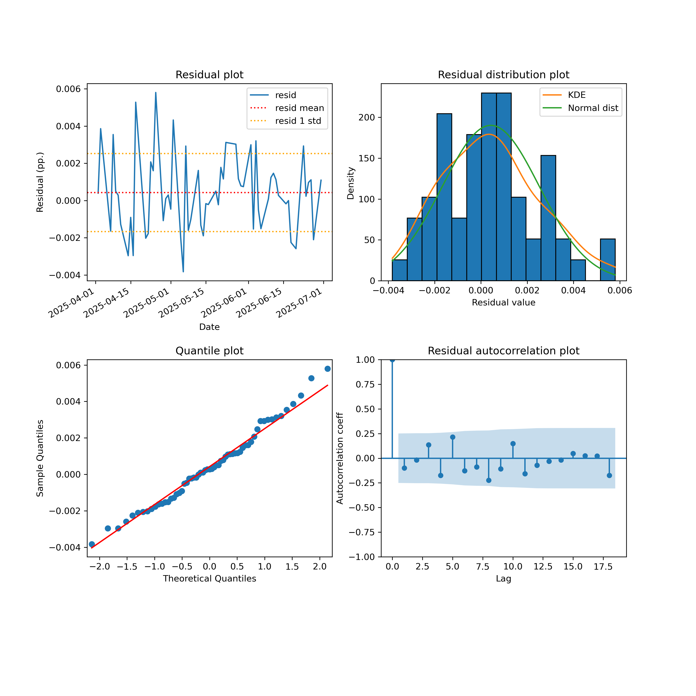
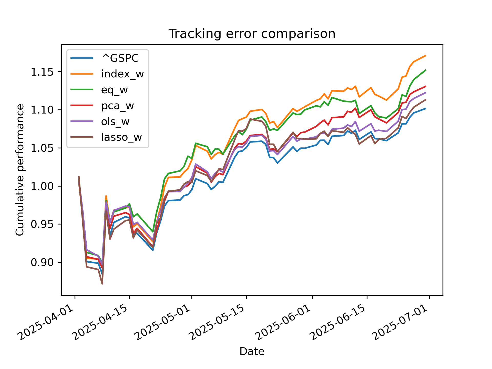

# S&P index replication using PCA, OLS, and Lasso

In this project, I present three approaches to replicating the S\&P 500 index using a limited number of securities, aiming to reduce the cost of index tracking. While the study is most applicable to niche indices lacking liquid futures or ETFs, due to the scarcity of high-quality financial data, I use the S\&P 500 index as a proxy, with the expectation that results can be generalised to other equity indices. 

The results slightly favour using Lasso weights to replicate the S\&P 500 index. However, the tracking error of other methods—including naïve estimators—is not significantly worse and may vary depending on the specific index and number of constituents selected.

**Disclaimer: This notebook is provided for informational and educational purposes only and does not constitute investment advice, a recommendation, or an offer to buy or sell any financial instrument.

## Index replication

### Naive replicators

First, I propose two naïve replication methods to serve as benchmarks for more advanced approaches:

- **Adjusted index weights**: I select the `n` names with the largest market capitalisation (which should closely reflect liquidity) and rescale their index weights to sum to one.
- **Equal weights**: Each selected name is assigned an equal weight of `1/n`.

To begin, I set `n = 50` and split the data into training and testing sets using a 50:50 proportion. Next, I calculate the price series for each basket and merge them into a single dataset. This will allow for a direct comparison of returns with other replication methods and the original index.

### PCA

Before fitting the PCA model, I first compute price returns on the training data. Then, I fit a correlation matrix using these returns. The SPTR total return data is excluded, as index returns are a linear combination of the returns of its constituents. Then, I fit a PCA.

We observe that approximately 20 principal components explain 95% of the variance. Going forward, I will focus on decompositions that capture 95% of the variance to mitigate the risk of overfitting.

Now, I will solve the following optimisation problem:

$\min_w \sum_{i=0}^{k} f_i^2 \, \sigma_i^\gamma$

subject to:
$0 < w_j < 1 \quad \text{for each } w_j \in w$

where:
- $f_i = w^T u_i - f_i^{\text{index}}$
- $f_i^{\text{index}} = w_{\text{index}}^T u_i$

Variables:

- $w$ is the 1 x $n$ weight vector which we try to optimise over.
- $f_i$ is the net i-th factor exposure of the hedge basket and the SPTR index.
- $\sigma_i$ is the variance explained by the i-th PCA component.
- $\gamma$ is the hyperparameter influencing how much the optimalisation focus on highly-explenative PCA components.
- $u_i$ is the 1 x $n$ vecotr of exposure to i-th PCA component (i.e. the i-th PCA eigenvector).
- $f_i^{index}$ is the SPTR index exposure to i-th PCA component.
- $w_{index}$ is the 1 x $n$ vector of index weights.

To simplify the problem, $\gamma$ will be fixed at 1 to avoid the need for hyperparameter optimisation. This choice does not significantly reduce the generality of the approach, but it helps mitigate the risk of overfitting.

Now, let's examine how the PCA exposures of the replication basket compare to those of the index after optimisation.

### OLS

Now, I fit an OLS regression of SPTR index returns on the returns of its components, using the resulting coefficients as replication basket weights. The regression is constrained to have only positive coefficients (as short positions are undesirable) and is fitted without an intercept.

### Lasso

Finally, I replicate the index using Lasso regression, with the regularisation hyperparameter selected via cross-validation. Unlike the previous two techniques, I do not specify the size or structure of the replicating basket, as coefficients with limited explanatory power are automatically shrunk to zero.

This time, unlike for previous replications, the sum of the Lasso weights deviates notably from one, which may be a slight concern. However, the model results in only 63 non-zero weights, which is a strong outcome given the original universe of over 500 securities.

## Model check

### Residual distribution

#### Index weights

#### Equal weights

#### PCA weights

#### OLS weights

#### Lasso weights

As shown in the charts above, residuals from most methods are well-behaved, except for those from the OLS model, which exhibit a slight fat-tailed behaviour—an indication of potential overfitting. This is not surprising, as both the PCA-based optimisation and Lasso regression are specifically designed to mitigate overfitting.

### Pseudo R-squared

All replication methods perform strongly out-of-sample, with pseudo R-squared values exceeding 95%. The highest is observed for the PCA replication approach, reaching 99%. Let’s now examine how this translates into tracking error.

### Tracking error

Interestingly, the OLS method yields the lowest tracking error across nearly all categories, while index-weight replication results in the highest. However, the median and average tracking errors for the PCA and Lasso replications are not far behind, indicating comparable performance.

